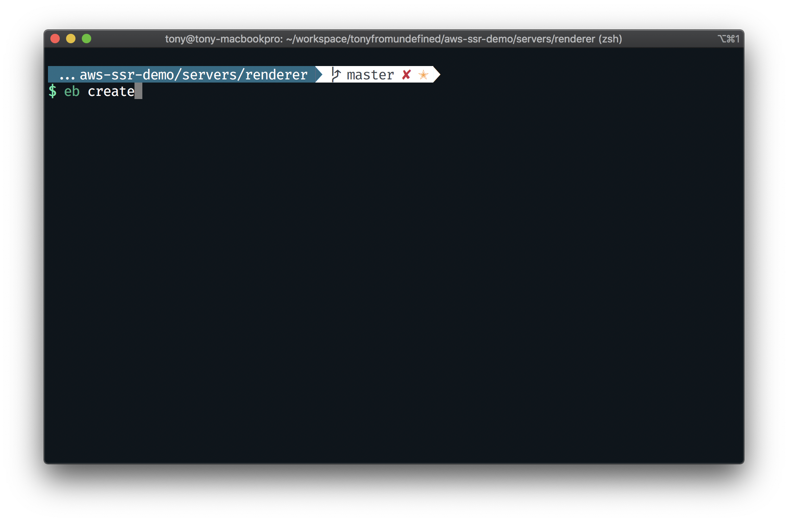
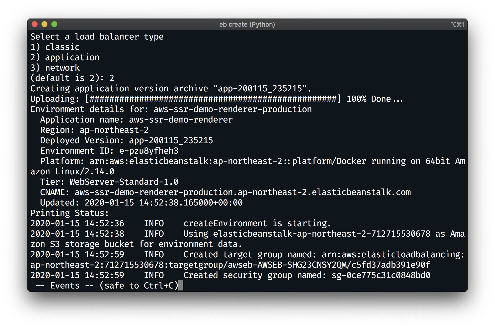

# EB CLI를 통해 EB 어플리케이션 만들기
> 만약 `0. 의존성 설치 및 프로젝트 빌드하기` 단계를 진행하지 않았다면, 배포 이전에 꼭 진행해주세요.

- 다음 명령어를 통해 EB 환경을 생성합니다.
  ```bash
  $ eb create
  ```
  

- 환경 이름에 `aws-ssr-demo-renderer-production`를 적습니다.
- `DNS CNAME prefix`는 기본값을 사용합니다.
  

- 로드밸런서 타입은 `application`을 선택합니다 (`2`)
  

- 배포가 진행됩니다
  


## 다음으로
0. 의존성 설치 및 프로젝트 빌드하기
1. IAM 사용자 만들기
2. EB CLI를 통해 EB 어플리케이션 만들기
3. EB CLI를 통해 EB 환경 만들기
4. **ElastiCache(Redis) 만들고 EB와 연결하기** [이동하기](../4_elasticache/README.md)
5. EB에 환경변수 주입하기
6. CloudFront로 정적 자원 제공 가속화하기
