# ElastiCache(Redis) 만들고 EB와 연결하기
- AWS Console에서 EC2 항목으로 이동합니다.
  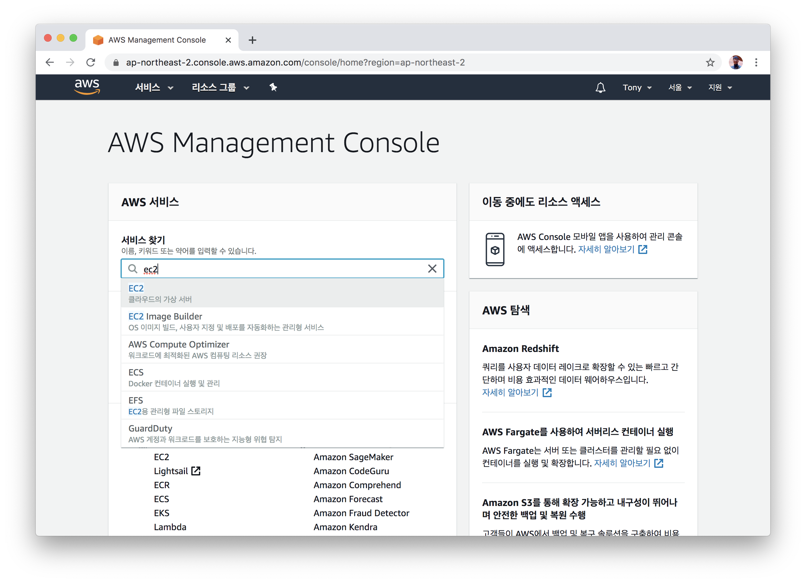

- `보안 그룹` 탭에서 `보안 그룹 생성`을 클릭합니다.
  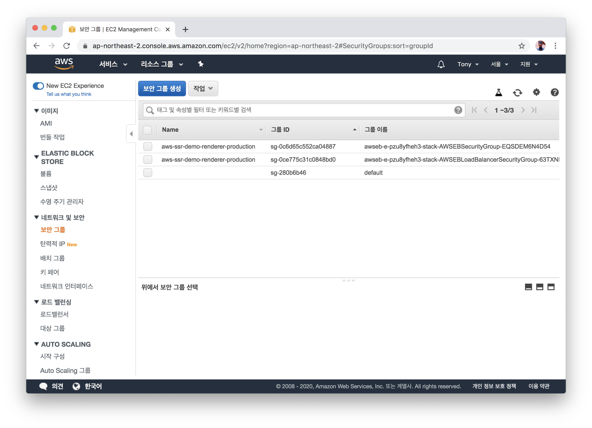

- `보안 그룹 이름`과 `설명`에 `aws-ssr-demo-renderer-redis`를 적습니다.
  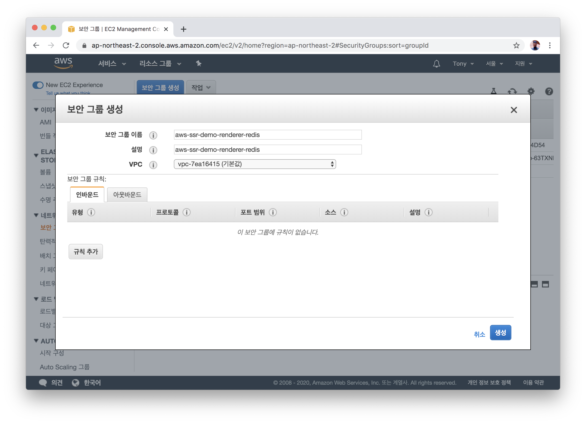

- `규칙 추가`를 클릭한 뒤,
  - `유형`은 `사용자 지정 TCP`
  - `프로토콜`은 `TCP`
  - `포트 범위`는 6379

  를 적어 넣습니다.

  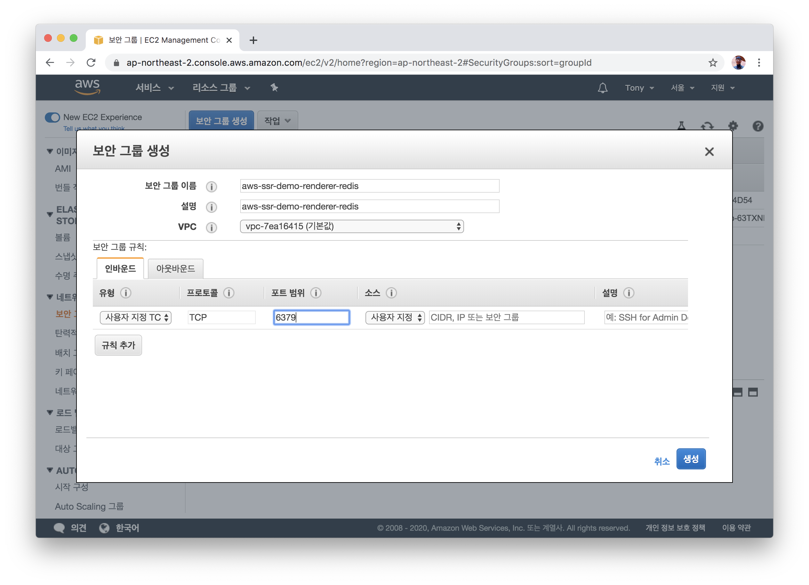

- `소스`에 `eb`를 입력하면 자동 완성되는 값들 중 `...AWSEBSecurityGroup...`을 선택합니다.
  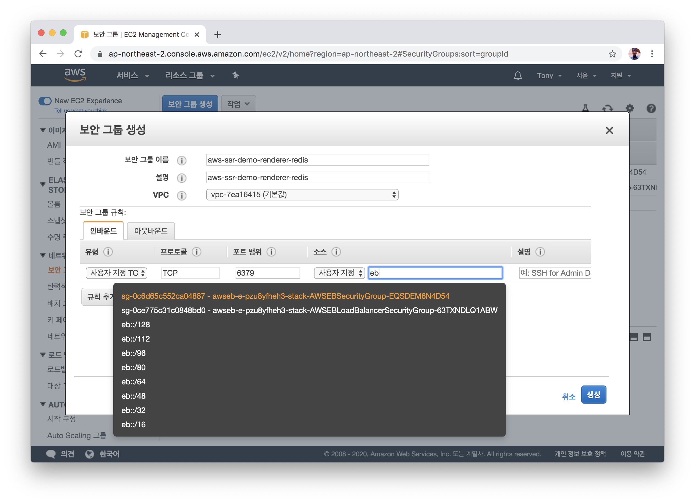

- `생성`을 클릭합니다.
  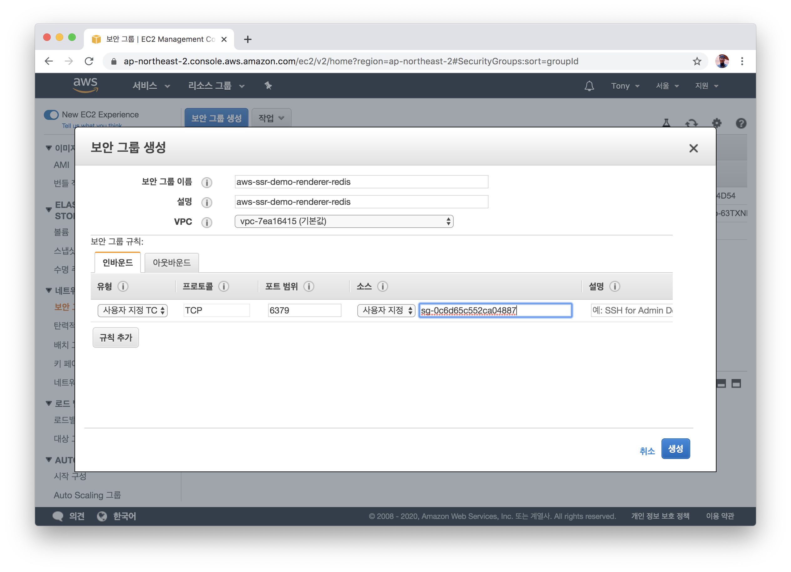

- AWS Console에서 ElastiCache 항목으로 이동합니다.
  

- `Redis` 탭에서 `생성`을 클릭합니다.
  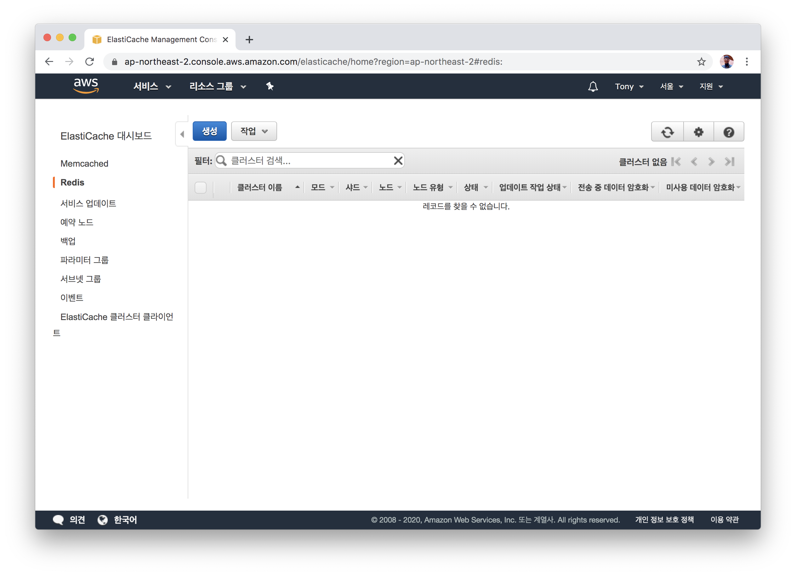

- `Redis`를 선택합니다 (기본값)
  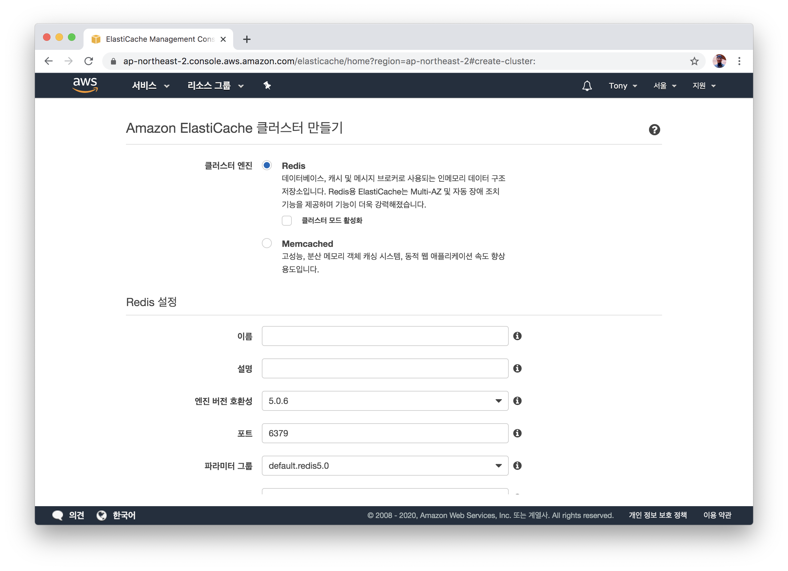

- `복제본 개수`를 `0`으로 설정합니다.
- `이름`을 `aws-ssr-demo-renderer-redis`로 설정합니다.
- `노드 유형`을 클릭합니다.
  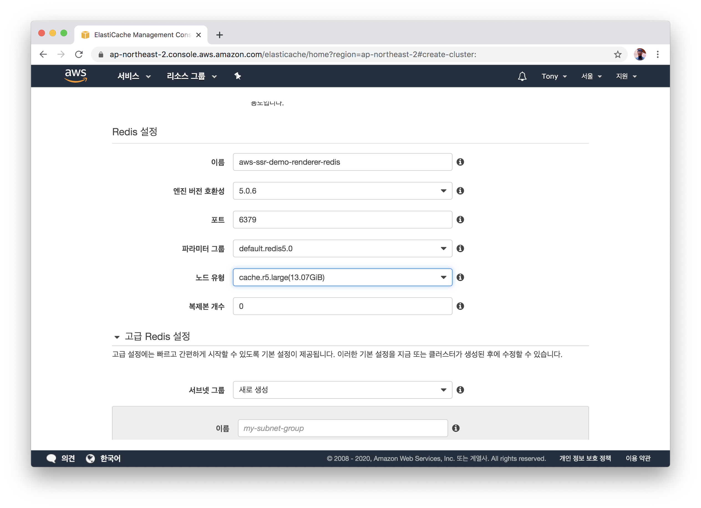

- `t2`탭에서 `cache.t2.micro`를 클릭합니다.
  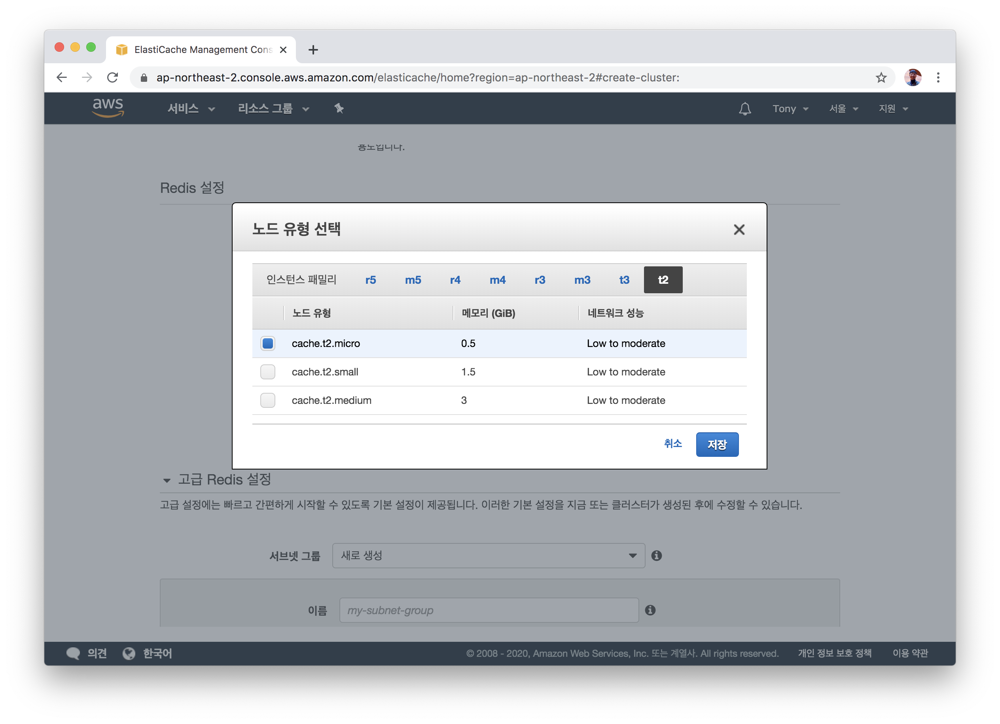

- `서브넷 그룹`에 `새로 생성`을 선택 한 뒤
- `이름`은 `aws-ssr-demo-renderer-redis-subnet`
- `서브넷`은 세개를 모두 선택합니다.
  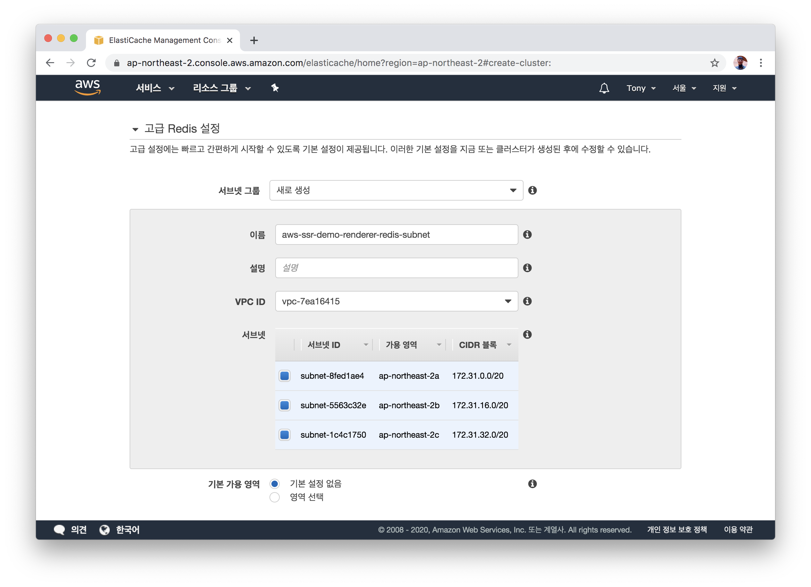

- `보안 그룹` 오른쪽에 연필 모양 아이콘을 클릭합니다.
  

- `aws-ssr-demo-renderer-redis`를 선택합니다.
  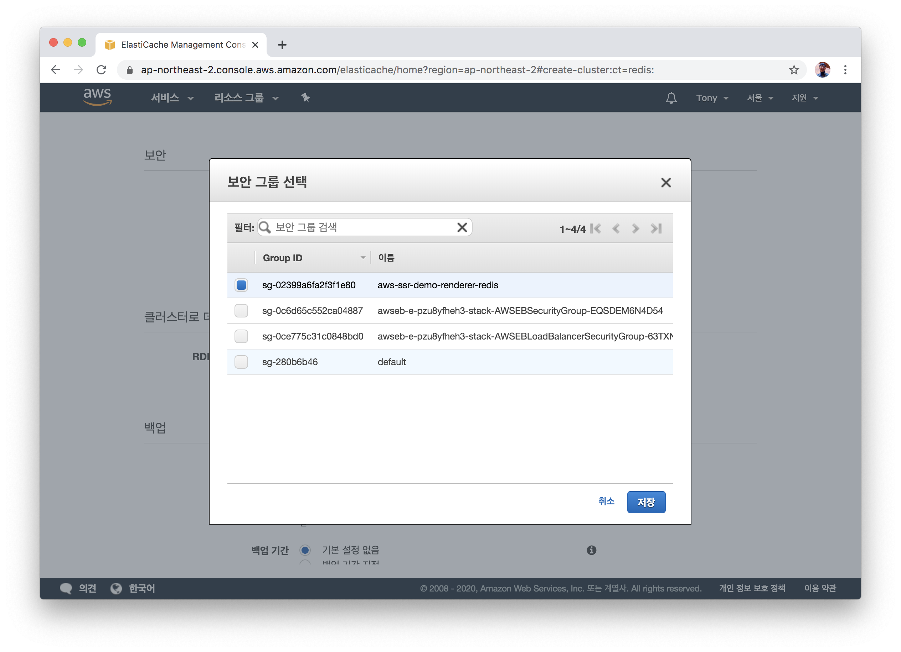

- `자동 백업 활성화`를 체크 해제 합니다.
- `생성` 버튼을 클릭합니다.
  

- Redis가 생성 완료되면, 출력된 `기본 엔드포인트`를 확인합니다.
  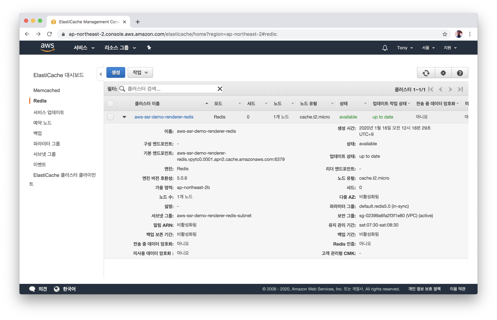

## 다음으로
0. 의존성 설치 및 프로젝트 빌드하기
1. IAM 사용자 만들기
2. EB CLI를 통해 EB 어플리케이션 만들기
3. EB CLI를 통해 EB 환경 만들기
4. ElastiCache(Redis) 만들고 EB와 연결하기
5. **EB에 환경변수 주입하기** [이동하기](../documents/5_eb_setenv/README.md)
6. CloudFront로 정적 자원 제공 가속화하기
